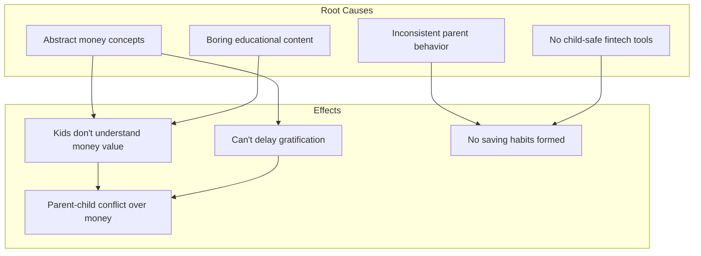

# Kumbo - Problem Statement

## The Problem

**Children aged 6-14 in Turkey struggle to understand the value of money and develop healthy saving habits because financial concepts are abstract, traditional teaching methods are inconsistent, and there is no engaging, child-safe tool that connects effort to reward in a tangible way.**

---

## Problem Decomposition

### For Children
| Problem Dimension | Specific Issue | Impact |
|-------------------|----------------|--------|
| **Abstraction** | Money is numbers on paper/screen with no tangible meaning | Can't grasp why they can't have things immediately |
| **Invisibility** | Saving progress is hidden (piggy bank, parent's pocket) | No motivation to continue saving |
| **Disconnect** | Effort (chores) doesn't feel connected to outcome (rewards) | Chores feel like punishment, not opportunity |
| **Boredom** | Financial education is dry, text-heavy, school-like | Disengagement, no retention |

### For Parents
| Problem Dimension | Specific Issue | Impact |
|-------------------|----------------|--------|
| **Inconsistency** | Hard to maintain regular allowance/chore tracking | Lessons don't stick, trust erodes |
| **Lack of Tools** | No structured, safe, educational app for kids' finance | Rely on ad-hoc methods that fail |
| **Control Concerns** | Worry about what kids see/do in apps | Avoid digital solutions entirely |
| **Measurement Gap** | No way to track if financial lessons are working | Don't know if child is actually learning |

---

## Root Cause Analysis

---

## What is Broken?

> **The feedback loop between a child's effort and their financial reward is invisible, delayed, and disconnected—making saving feel abstract and pointless.**

## Why Does This Matter?

1. **Financial habits form early**: Ages 6-14 are critical for developing money mindset
2. **Current solutions fail**: Piggy banks are invisible; banking apps are adult-focused; educational apps are boring
3. **Parents are frustrated**: They want to teach but lack effective tools
4. **Consequences are real**: Without early financial literacy, children become financially illiterate adults

## Who Feels This Most?

**Primary**: Children who want specific goals (toys, games, experiences) but have no way to visualize or control their progress toward getting them.

**Secondary**: Parents who care about financial education but struggle with consistency and lack proper tools.

---

## Success Criteria for Solution

A valid solution must:
1. ✅ Make saving **visual and tangible** for children
2. ✅ Connect **effort (chores) to reward** in real-time
3. ✅ Be **simple enough** for a 6-year-old
4. ✅ Give parents **visibility and control**
5. ✅ Be **100% child-safe** (no ads, no external links, privacy-first)
6. ✅ **Teach** financial concepts without feeling like school
